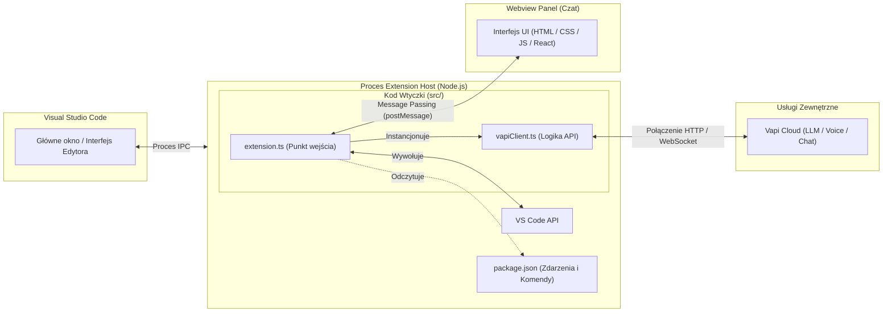
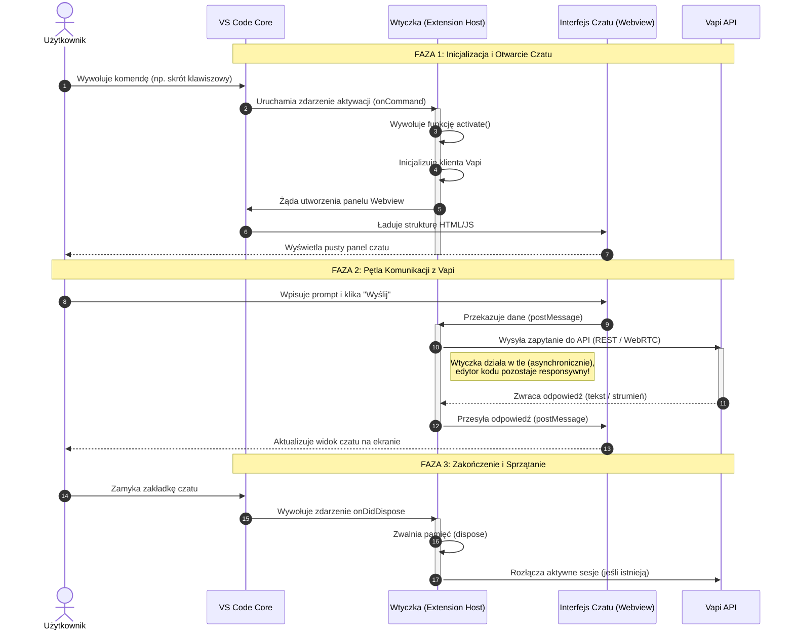

```mermaid
flowchart LR
    subgraph VSCode["Visual Studio Code"]
        CoreUI["Główne okno / Interfejs Edytora"]
    end

    subgraph ExtHost["Proces Extension Host (Node.js)"]
        API["VS Code API"]
        Manifest["package.json (Zdarzenia i Komendy)"]
        
        subgraph PluginLogic["Kod Wtyczki (src/)"]
            Main["extension.ts (Punkt wejścia)"]
            VapiClient["vapiClient.ts (Logika API)"]
        end
        
        Main <-->|"Wywołuje"| API
        Main -->|"Instancjonuje"| VapiClient
        Main -.->|"Odczytuje"| Manifest
    end

    subgraph WebviewContext["Webview Panel (Czat)"]
        ChatUI["Interfejs UI (HTML / CSS / JS / React)"]
    end

    subgraph External["Usługi Zewnętrzne"]
        VapiAPI["Vapi Cloud (LLM / Voice / Chat)"]
    end

    CoreUI <-->|"Proces IPC"| ExtHost
    Main <-->|"Message Passing (postMessage)"| ChatUI
    VapiClient <-->|"Połączenie HTTP / WebSocket"| VapiAPI
```

---

### Pełny Cykl Życia i Komunikacja Czatu (Sequence Diagram)

```mermaid
sequenceDiagram
    autonumber
    actor User as Użytkownik
    participant VSCode as VS Code Core
    participant Ext as Wtyczka (Extension Host)
    participant Webview as Interfejs Czatu (Webview)
    participant Vapi as Vapi API

    Note over VSCode, Vapi: FAZA 1: Inicjalizacja i Otwarcie Czatu
    User->>VSCode: Wywołuje komendę (np. skrót klawiszowy)
    VSCode->>Ext: Uruchamia zdarzenie aktywacji (onCommand)
    activate Ext
    Ext->>Ext: Wywołuje funkcję activate()
    Ext->>Ext: Inicjalizuje klienta Vapi
    Ext->>VSCode: Żąda utworzenia panelu Webview
    VSCode->>Webview: Ładuje strukturę HTML/JS
    Webview-->>User: Wyświetla pusty panel czatu
    deactivate Ext

    Note over User, Vapi: FAZA 2: Pętla Komunikacji z Vapi
    User->>Webview: Wpisuje prompt i klika "Wyślij"
    Webview->>Ext: Przekazuje dane (postMessage)
    activate Ext
    Ext->>Vapi: Wysyła zapytanie do API (REST / WebRTC)
    activate Vapi
    Note right of Ext: Wtyczka działa w tle (asynchronicznie),<br/>edytor kodu pozostaje responsywny!
    Vapi-->>Ext: Zwraca odpowiedź (tekst / strumień)
    deactivate Vapi
    Ext->>Webview: Przesyła odpowiedź (postMessage)
    deactivate Ext
    Webview-->>User: Aktualizuje widok czatu na ekranie

    Note over VSCode, Vapi: FAZA 3: Zakończenie i Sprzątanie
    User->>VSCode: Zamyka zakładkę czatu
    VSCode->>Ext: Wywołuje zdarzenie onDidDispose
    activate Ext
    Ext->>Ext: Zwalnia pamięć (dispose)
    Ext->>Vapi: Rozłącza aktywne sesje (jeśli istnieją)
    deactivate Ext
```