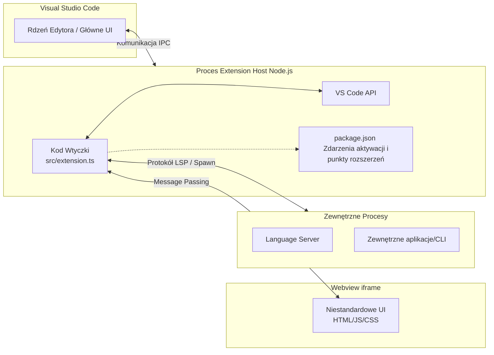
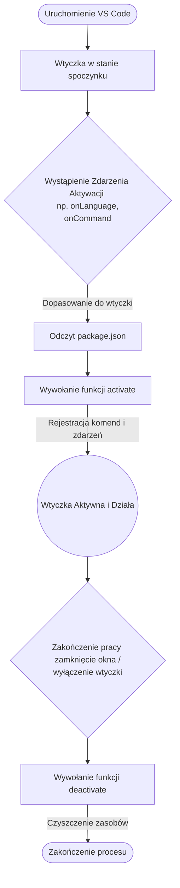

### Architektura Wtyczki VS Code

```mermaid
flowchart LR
    subgraph VSCode[Visual Studio Code]
        Core[Rdzeń Edytora / Główne UI]
    end

    subgraph ExtHost[Proces Extension Host Node.js]
        API[VS Code API]
        Ext[Kod Wtyczki \n src/extension.ts]
        Manifest[package.json \n Zdarzenia aktywacji i punkty rozszerzeń]
        
        Ext -.-> Manifest
        Ext <--> API
    end

    subgraph External[Zewnętrzne Procesy]
        LSP[Language Server]
        CLI[Zewnętrzne aplikacje/CLI]
    end

    subgraph WebviewContext[Webview iframe]
        UI[Niestandardowe UI \n HTML/JS/CSS]
    end

    Core <-->|Komunikacja IPC| ExtHost
    Ext <-->|Message Passing| UI
    Ext <-->|Protokół LSP / Spawn| External
```

---

### Przepływ i Cykl Życia (Flow Diagram)

```mermaid
flowchart TD
    Start([Uruchomienie VS Code])
    Inactive[Wtyczka w stanie spoczynku]
    Event{Wystąpienie Zdarzenia Aktywacji \n np. onLanguage, onCommand}
    ReadManifest[Odczyt package.json]
    Activate[Wywołanie funkcji activate]
    Running((Wtyczka Aktywna i Działa))
    TriggerDeactivate{Zakończenie pracy \n zamknięcie okna / wyłączenie wtyczki}
    Deactivate[Wywołanie funkcji deactivate]
    Stop([Zakończenie procesu])

    Start --> Inactive
    Inactive --> Event
    Event -->|Dopasowanie do wtyczki| ReadManifest
    ReadManifest --> Activate
    Activate -->|Rejestracja komend i zdarzeń| Running
    Running --> TriggerDeactivate
    TriggerDeactivate --> Deactivate
    Deactivate -->|Czyszczenie zasobów| Stop
```