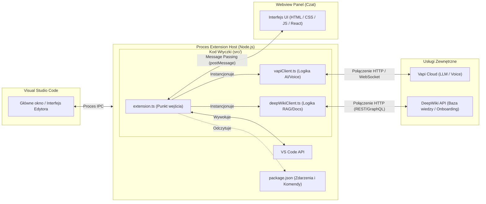
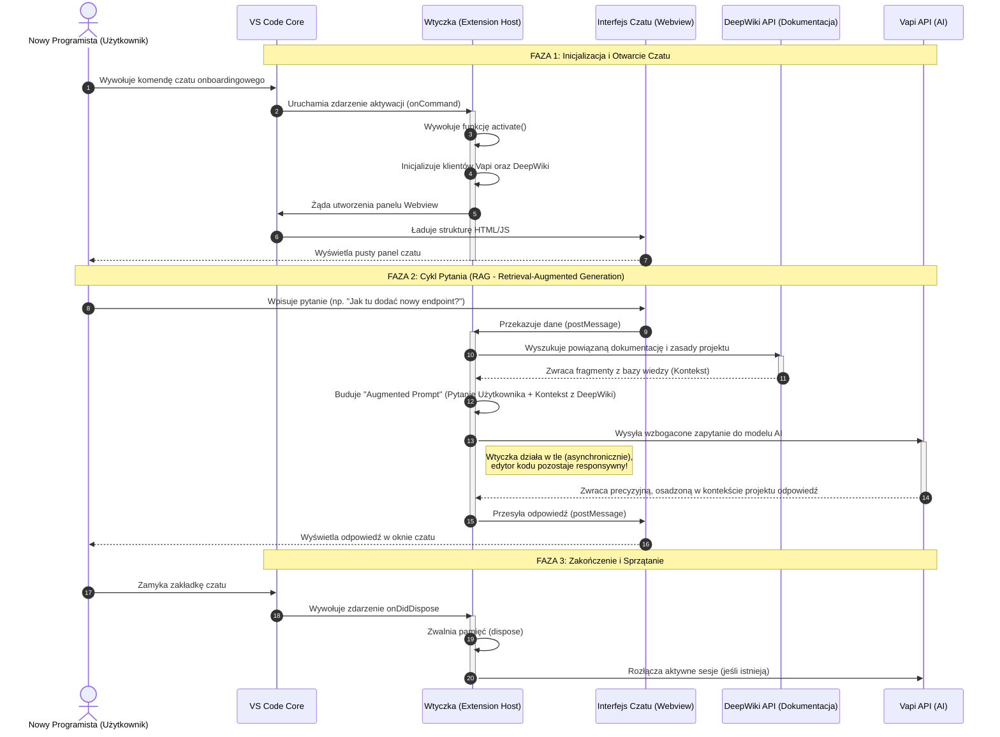

```mermaid
flowchart LR
    subgraph VSCode["Visual Studio Code"]
        CoreUI["Główne okno / Interfejs Edytora"]
    end

    subgraph ExtHost["Proces Extension Host (Node.js)"]
        API["VS Code API"]
        Manifest["package.json (Zdarzenia i Komendy)"]
        
        subgraph PluginLogic["Kod Wtyczki (src/)"]
            Main["extension.ts (Punkt wejścia)"]
            VapiClient["vapiClient.ts (Logika AI/Voice)"]
            WikiClient["deepWikiClient.ts (Logika RAG/Docs)"]
        end
        
        Main <-->|"Wywołuje"| API
        Main -->|"Instancjonuje"| VapiClient
        Main -->|"Instancjonuje"| WikiClient
        Main -.->|"Odczytuje"| Manifest
    end

    subgraph WebviewContext["Webview Panel (Czat)"]
        ChatUI["Interfejs UI (HTML / CSS / JS / React)"]
    end

    subgraph External["Usługi Zewnętrzne"]
        VapiAPI["Vapi Cloud (LLM / Voice)"]
        DeepWikiAPI["DeepWiki API (Baza wiedzy / Onboarding)"]
    end

    CoreUI <-->|"Proces IPC"| ExtHost
    Main <-->|"Message Passing (postMessage)"| ChatUI
    VapiClient <-->|"Połączenie HTTP / WebSocket"| VapiAPI
    WikiClient <-->|"Połączenie HTTP (REST/GraphQL)"| DeepWikiAPI
```

---

### Pełny Cykl Życia z Wzbogacaniem Kontekstu (RAG Flow)

```mermaid
sequenceDiagram
    autonumber
    actor User as Nowy Programista (Użytkownik)
    participant VSCode as VS Code Core
    participant Ext as Wtyczka (Extension Host)
    participant Webview as Interfejs Czatu (Webview)
    participant DeepWiki as DeepWiki API (Dokumentacja)
    participant Vapi as Vapi API (AI)

    Note over VSCode, Vapi: FAZA 1: Inicjalizacja i Otwarcie Czatu
    User->>VSCode: Wywołuje komendę czatu onboardingowego
    VSCode->>Ext: Uruchamia zdarzenie aktywacji (onCommand)
    activate Ext
    Ext->>Ext: Wywołuje funkcję activate()
    Ext->>Ext: Inicjalizuje klientów Vapi oraz DeepWiki
    Ext->>VSCode: Żąda utworzenia panelu Webview
    VSCode->>Webview: Ładuje strukturę HTML/JS
    Webview-->>User: Wyświetla pusty panel czatu
    deactivate Ext

    Note over User, Vapi: FAZA 2: Cykl Pytania (RAG - Retrieval-Augmented Generation)
    User->>Webview: Wpisuje pytanie (np. "Jak tu dodać nowy endpoint?")
    Webview->>Ext: Przekazuje dane (postMessage)
    activate Ext
    
    Ext->>DeepWiki: Wyszukuje powiązaną dokumentację i zasady projektu
    activate DeepWiki
    DeepWiki-->>Ext: Zwraca fragmenty z bazy wiedzy (Kontekst)
    deactivate DeepWiki
    
    Ext->>Ext: Buduje "Augmented Prompt" (Pytanie Użytkownika + Kontekst z DeepWiki)
    
    Ext->>Vapi: Wysyła wzbogacone zapytanie do modelu AI
    activate Vapi
    Note right of Ext: Wtyczka działa w tle (asynchronicznie),<br/>edytor kodu pozostaje responsywny!
    Vapi-->>Ext: Zwraca precyzyjną, osadzoną w kontekście projektu odpowiedź
    deactivate Vapi
    
    Ext->>Webview: Przesyła odpowiedź (postMessage)
    deactivate Ext
    Webview-->>User: Wyświetla odpowiedź w oknie czatu

    Note over VSCode, Vapi: FAZA 3: Zakończenie i Sprzątanie
    User->>VSCode: Zamyka zakładkę czatu
    VSCode->>Ext: Wywołuje zdarzenie onDidDispose
    activate Ext
    Ext->>Ext: Zwalnia pamięć (dispose)
    Ext->>Vapi: Rozłącza aktywne sesje (jeśli istnieją)
    deactivate Ext
```